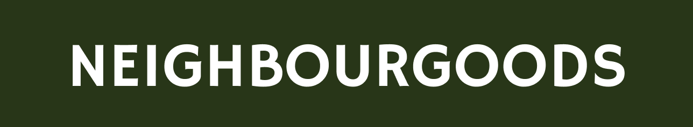
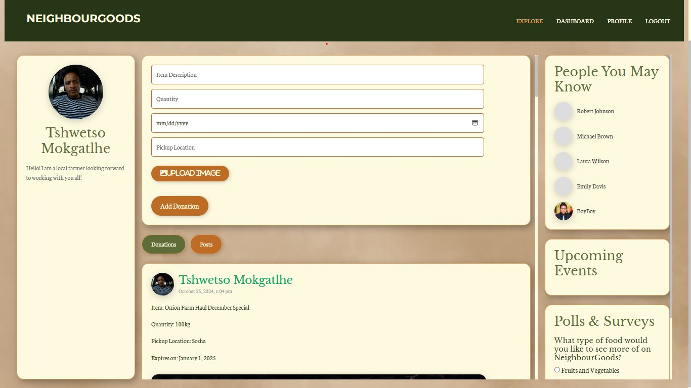
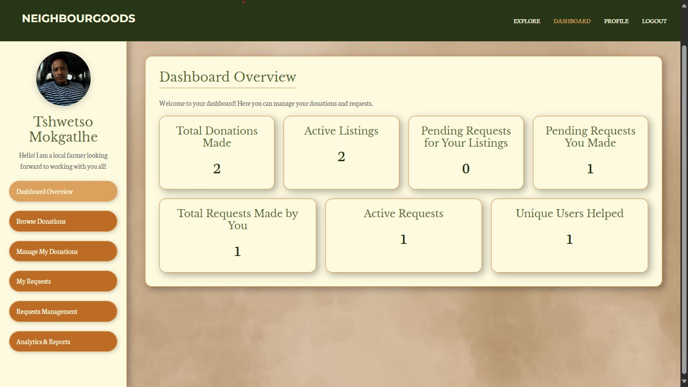
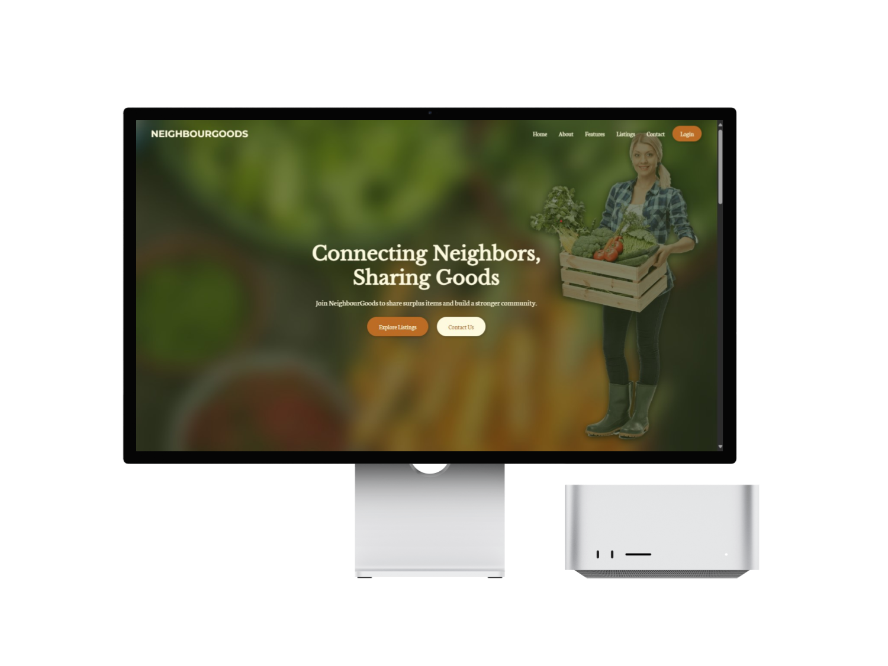
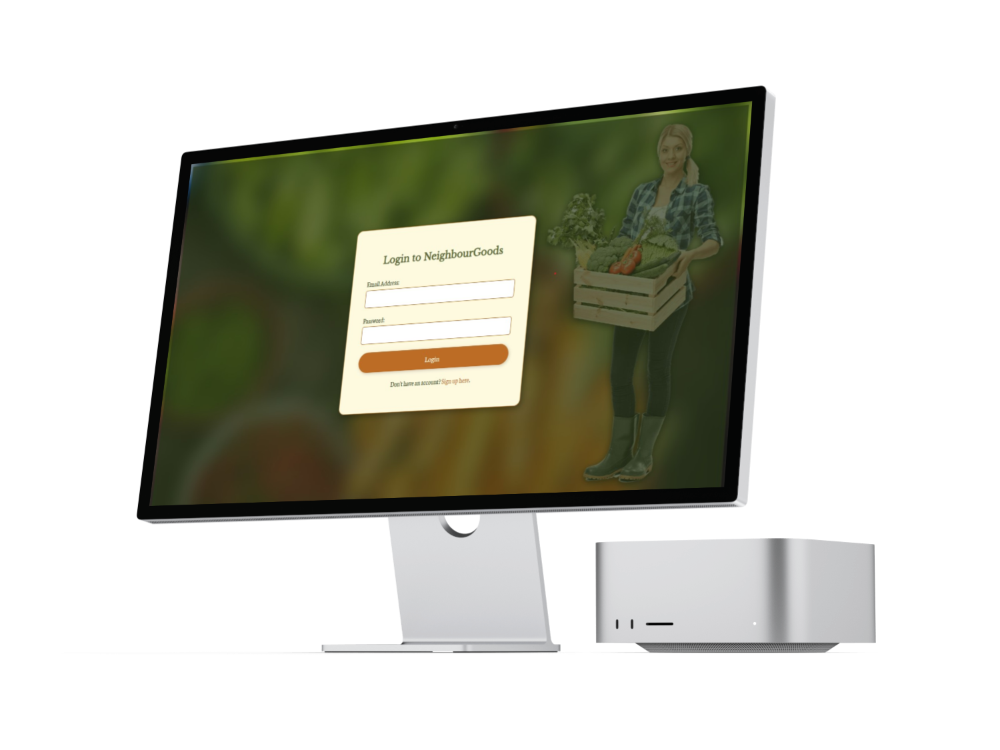
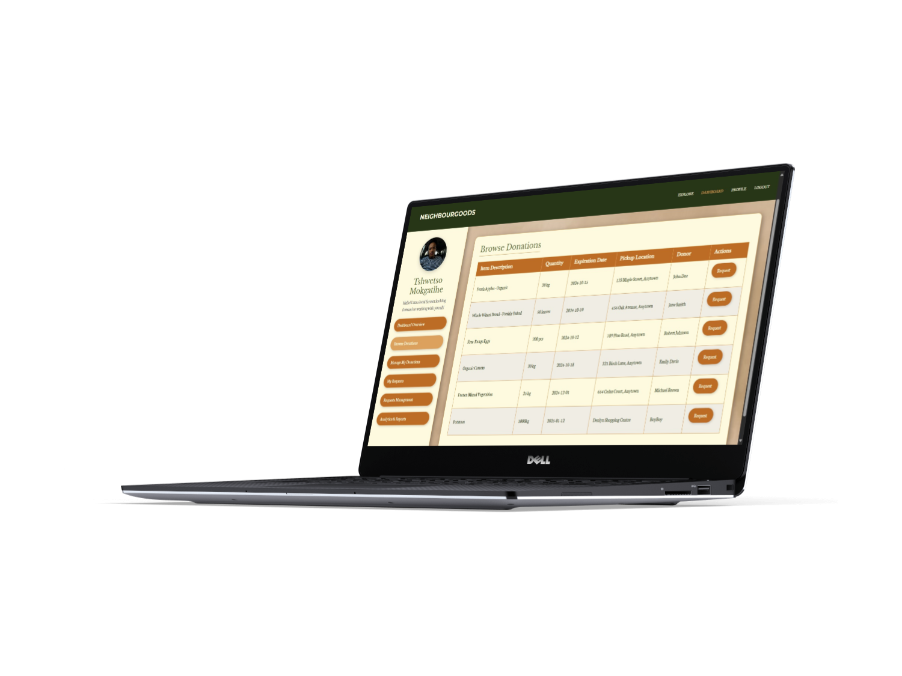
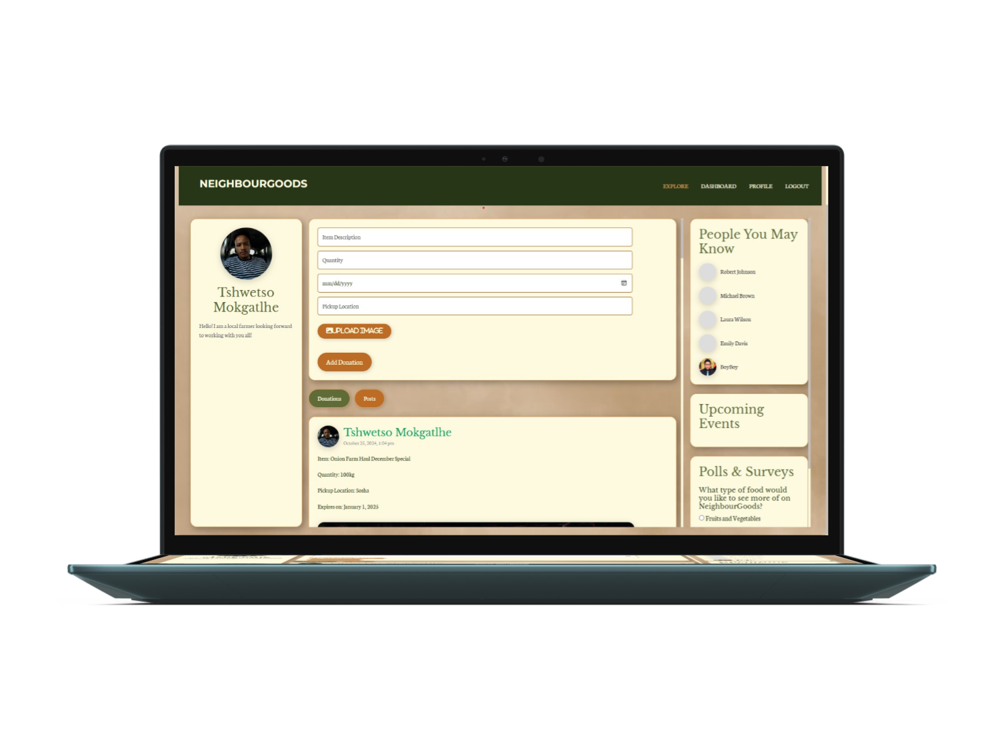
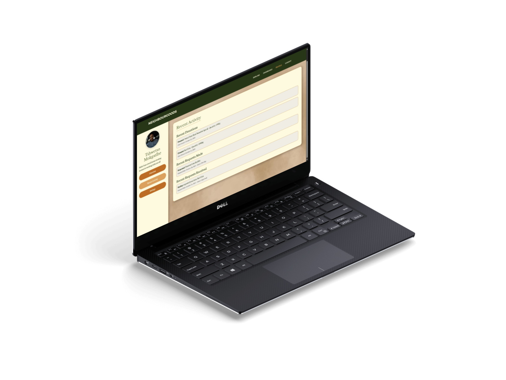

 

<h5 align="center" style="padding:0;margin:0;">Tshwetso Mokgatlhe</h5> 
<h5 align="center" style="padding:0;margin:0;"> 221411 </h5> 
<h6 align="center">DV200 | Term 4</h6>   

  
<h3 align="center">NeighbourGoods</h3> 

 NeighbourGoods is a community-driven platform designed to reduce food waste and foster stronger neighborhood connections by enabling users to share surplus food and goods with others in their community. Join us to build a more sustainable and connected community.    
  <!-- <a href="https://youtu.be/your-demo-link">View Demo</a> --> · 
<a href="https://github.com/TshwetsoMo/NeihbourGoods/issues">Report Bug</a> · <a href="https://github.com/TshwetsoMo/NeihbourGoods/issues">Request Feature</a> 

<!-- TABLE OF CONTENTS -->

## Table of Contents

About the Project
Project Description
Built With
Getting Started
Prerequisites
Installation
Features and Functionality
Concept Process
Ideation
Wireframes
Development Process
Implementation Process
Highlights
Challenges
Future Implementation
Final Outcome
Mockups
Video Demonstration
Conclusion
License
Contact
Acknowledgements

<!-- ABOUT THE PROJECT -->

## About the Project

### Project Description

NeighbourGoods is a community-driven platform designed to reduce food waste and foster stronger neighborhood connections by enabling users to share surplus food and goods with others in their community. The website serves as a hub where individuals can donate excess items, request needed goods, and engage with their neighbors to build a more sustainable and connected community.

## Built With

                           

## Getting Started

These instructions will help you set up the project on your local machine for development and testing purposes.

### Prerequisites

XAMPP: You will need to install XAMPP to run Apache and MySQL on your local machine.

Download XAMPP

### Basic Knowledge: Familiarity with PHP, MySQL, and web development is recommended.

### Installation

Here are a couple of ways to clone this repo:

GitHub Desktop

Enter https://github.com/YourUsername/NeighbourGoods.git into the URL field and press the Clone button.

Clone Repository

Run the following command in your terminal to clone the project:

git clone https://github.com/TshwetsoMo/NeihbourGoods.git

### Set Up XAMPP

Start XAMPP and run Apache and MySQL modules.
Place the project folder inside the htdocs directory.
Import the provided SQL file into your MySQL database using phpMyAdmin.

### Features and Functionality

User Registration and Login: Secure user authentication with password hashing.
Profile Management: Users can update their profiles, including bio, availability, and needs.
Donations: Users can list items they wish to donate, specifying details like description, quantity, and expiration date.
Requests: Users can request items from others and manage incoming requests for their own listings.
Recent Activity Feed: Displays recent donations, requests made, and requests received.
Responsive Design: Optimized for both desktop and mobile devices.

## Concept Process

### Ideation

The idea behind NeighbourGoods is to create a platform that encourages community engagement and reduces waste by allowing neighbors to share surplus food and goods.

### Wireframes

## Development Process

### Implementation Process

Backend Development: Utilized PHP and MySQL for server-side scripting and database management.
Frontend Development: Employed HTML, CSS, and Bootstrap 5 for responsive and accessible design.
Security Measures: Implemented prepared statements and input validation to protect against SQL injection and XSS attacks.
Highlights
Successfully integrated a user-friendly interface that allows seamless navigation.
Implemented a robust request management system that enhances user interaction.
Achieved a consistent and appealing design across all pages.

### Challenges

Ensuring data security and user privacy was a significant challenge that required careful handling of user inputs and database queries.
Designing a responsive layout that adapts well to different screen sizes involved meticulous planning and testing.
Integrating real-time updates for requests and notifications.

### Future Implementation

Community Events: Adding features for users to organize and participate in local events.
Mobile Application: Developing a mobile app version for easier access.
User Ratings and Reviews: Implementing a system for users to rate and review each other to build trust within the community.

## Final Outcome

 

### Mockups

 

### Video Demonstration

<!-- Provide a link to your project's demo video -->

### View Demonstration

## Conclusion

NeighbourGoods serves as a platform that not only helps reduce food waste but also strengthens community bonds. By enabling easy sharing and requesting of items, it fosters a sense of community and promotes sustainable living.

## License

Distributed under the MIT License. See LICENSE for more information.

## Contact

Tshwetso Mokgatlhe - Personal Email - GitHub

Project Link: https://github.com/TshwetsoMo/NeihbourGoods.git
Acknowledgements
ChatGPT
Bootstrap
SweetAlert2
Google Fonts

<!-- Images -->
